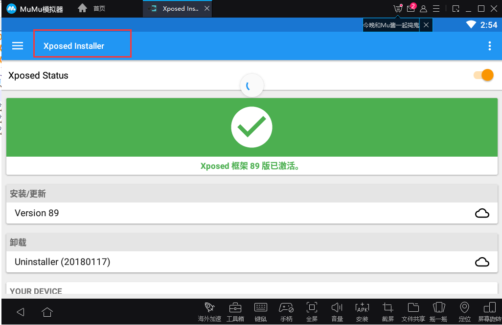
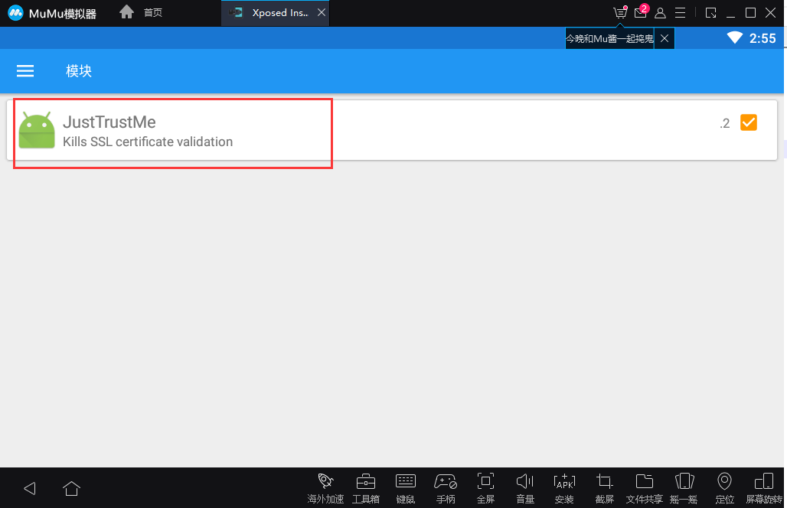
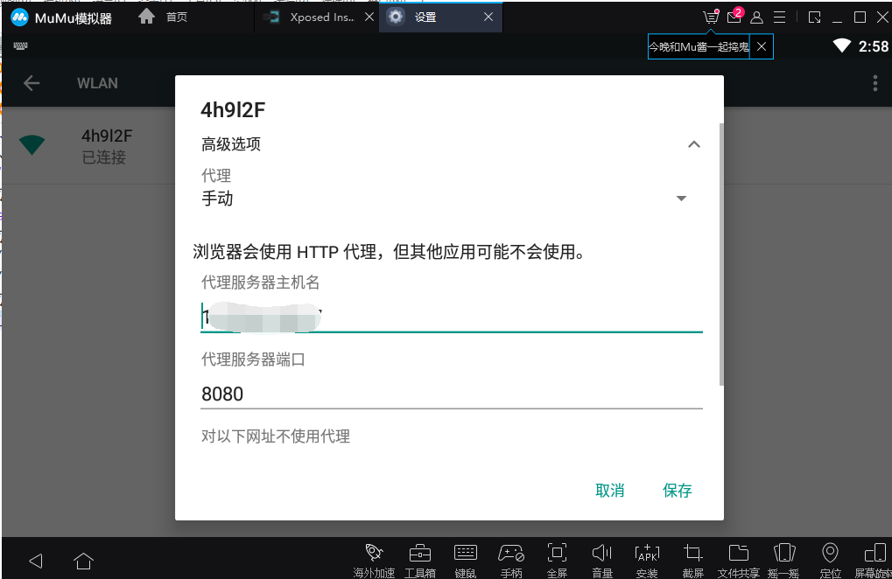

# 9、10工具-burpsuite篇
## 1. 对特定网站进行渗透测试，行成测试报告
## 2. 对ssl pining应用进行抓包
* 采用了模拟器+xposed+just trust me 进行抓包
1. 模拟器采用的是mumu模拟器，安装mumu模拟器

2. 下载xposed并在模拟器中进行安装。（查看android版本，android 5.0及以上安装xposed3.1.5及以上版本。（下载地址：https://forum.xda-developers.com/showthread.php?t=3034811））安装完成后，打开xposed进行更新

3. 更新完成后，手动进行重启，否则容易卡死。
4. xposed激活后，下载just trust me 并在xposed中进行安装。


5. 下载app包并在模拟器中进行安装
6. 设置模拟器的wifi代理，代理地址为主机的地址，端口为burp的默认端口8080

7. burpsuite设置监听端口，监听模拟器设置的代理端口
8. 备注：问题记录
	* 安装xposed报错
	```
	sh: <stdin>[8]: /data/data/de.robv.android.xposed.installer/cache/update-binary: not executable: 32-bit ELF file
Error 1 occurred
	```
	* 解决方法：解决方法：设置-应用兼容性-关闭兼容性。重启模拟器，重新安装xposed。重新下载安装即可。
	