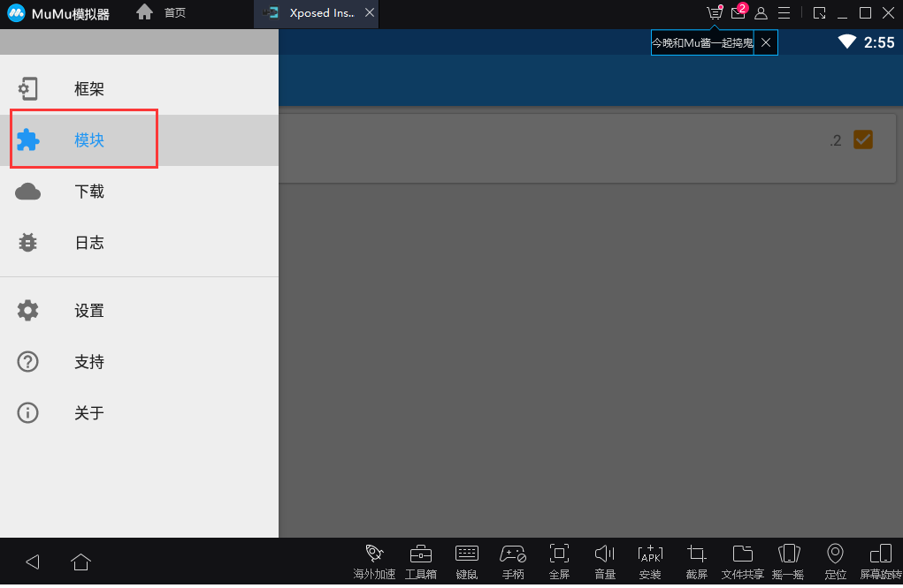

# 9、10工具-burpsuite篇
## 1. 对特定网站进行渗透测试，行成测试报告
## 2. 对ssl pining应用进行抓包
* 采用了模拟器+xposed+just trust me 进行抓包
1. 模拟器采用的是mumu模拟器，安装mumu模拟器

2. 下载xposed并在模拟器中进行安装

3. 下载just trust me 并在xposed中进行安装。

4. 下载app包并在模拟器中进行安装
5. 设置模拟器的wifi代理，代理地址为主机的地址，端口为burp的默认端口8080

