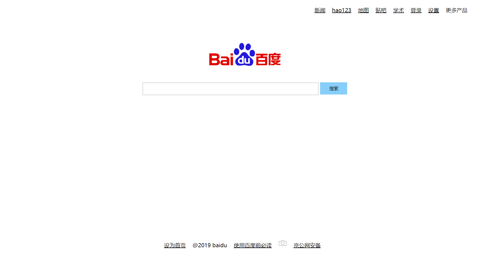

# 前端
### 1. 模仿百度首页写一个静态页面
```
<!DOCTYPE html>
<html>
    <head>
        <title>百度一下，你就知道</title>
    </head>
    <body>
        <div>
            <div id=header>
                <ul class="none">
                    <li><a href="#">新闻</a></li>
                    <li><a href="#">hao123</a></li>
                    <li><a href="#">地图</a></li>
                    <li><a href="#">贴吧</a></li>
                    <li><a href="#">学术</a></li>
                    <li><a href="#">登录</a></li>
                    <li><a href="#">设置</a></li>
                    <li>更多产品</li>
                </ul>
            </div>
            <div id=bdheader>
                
                <form id=fdform>
                    <input class=searchinput type="text" name="search">
                    <!--  -->
                    <input class=sibt type="button" name="searchbt" value="搜索">
                </form>
            </div>
            <!-- <div id=kb></div> -->
            <div id=footer>
                <ul class="none">
                    <li><a href="#">设为首页</a></li>
                    <li>@2019 baidu</li>
                    <li><a href="#">使用百度前必读</a></li>
                    <li><span></span></li>
                    <li><a href="#">京公网安备</a></li>
                </ul>
            </div>
        </div>
    </body>
    <style>
        body{
            display: block;
        }
        #header{
            margin:19px 0px 5px;
            padding: 0px 96px 0px 96px;
            height: 24px;
            width: 482px;
            position: absolute;
            right: 0px;
            top: 0px;
            /* background:blueviolet; */
        }
        ul.none{
            list-style-type: none;
            margin: 0;
            padding: 0;
        }
        ul.none li{
            display: inline;
            padding-left: 15px;;
        }
        ul.none a{
            color: black;
        }
        ul.none img{
            height: 25px;
            width: 25px;
            margin-top: 3px;
        }
        #bdheader{
            text-align: center;
            position: relative;
            top: 60px;
        }
        #bdheader img{
            width: 270px;
            height: 129px;
            margin: 10px;
        }
        #fdform{
            height: 37px;
            width: 641px;
            margin: 22px auto 0;
            padding: 0;
            /* background: chartreuse; */
        }
        #bdheader .searchinput{
            height: 33px;
            width: 515px;
            /* border: 0; */
            margin: 0;
            padding: 0;
        }
        /* #bdheader .phbt{
            height: 32px;
            width: 32px;
            margin: 0;
        } */
        #bdheader .sibt{
            height: 36px;
            width: 80px;
            border: 1px;
            background: lightskyblue;
        }
        #footer{
            height: 37px;
            width: 97%;
            position: absolute;
            bottom: 5px;
            /* background: magenta; */
            text-align: center;
            margin-bottom: 10px;
        }
    </style>
</html>
```
#### 结果页面


### 