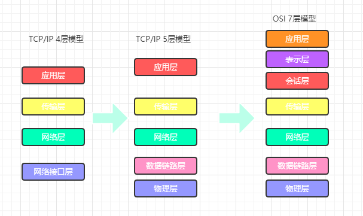
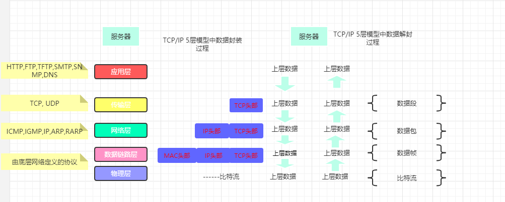
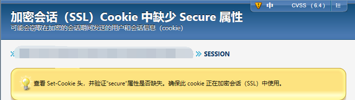

# 第五节：web基础知识
### ISO 7层模型 & TCP 5层模型 & tcp 4层模型

### tcp协议

### ISO 7层模型及协议
分层 | 功能 | 功能预览 | 协议
--- | --- | --- | ---
==应用层==|针对特定应用的协议|电子邮件协议、远程登录等| FTP,WWW,Telnet,NFS,SMTP,Gateway,SNMP,HTTP,SSH
表示层|设备固有数据格式和网络标准数据格式的转换|接收不同表现形式的信息，如文字流、图像、声音等|TIFF,GIF,JPEG,PICT,ASCII,EBCDIC,encryption，MPEG,MIDI,HTML
会话层|通信管理，负责建立和断开通信连接|何时建立连接，何时断开连接以及保持多久的连接|RPC,SQL,NFS,NetBIOS,names,AppleTalk,ASP,DECnet,SCP
==传输层==|管理两个节点之间的数据传输，负责可靠传输|判断是否有数据丢失|TCP,UDP,SPX
网络层|地址管理与路由选择 | 径过哪个路由传递到目标地址|IP,IPX,AppleTalk DDP
数据链路层|互连设备之间传送和识别数据帧|数据帧和比特流之间的转换，分段转发|Frame Relay,HDLC,PPP,IEEE 802.3/802.2,FDDI,ATM,IEEE 802.5/802.2
物理层|以0，1代表点压的高低、灯光的闪灭|比特流与电子信号的切换|EIA/TIA-232,EIA/TIA-499,V.35,V.24,RJ45,Ethernet,802.3,802.5,FDDI,NRZI,NRZ,B8ZS
### cookie漏洞报告
1. 会话cookie中缺少httpOnly属性（低危）
* 漏洞情况：查看或响应中cookie信息，缺少HttpOnly属性
* 漏洞危害：会导致攻击者可以通过程序(JS脚本、Applet等)获取到用户的cookie信息，造成用户cookie信息泄露，增加攻击者的跨站脚本攻击威胁。
* 解决建议：向所有会话cookie中添加“HttpOnly”属性。
2. 加密会话（ssl）中缺少secure属性（中危）

* 漏洞情况：查看set-cookie头，缺少secure属性
* 漏洞危害：可能会切取加密会话期间发送的用户信息和会话信息
* 解决建议：向加密会话cookie中增加secure属性
### 同源策略 
同源策略（Same origin policy）是一种约定，它是浏览器最核心也最基本的安全功能，如果缺少了同源策略，则浏览器的正常功能可能都会受到影响。可以说Web是构建在同源策略基础之上的，浏览器只是针对同源策略的一种实现。  
    * 同源，指两个页面的主域名、域名协议、端口号、子级域名等相同